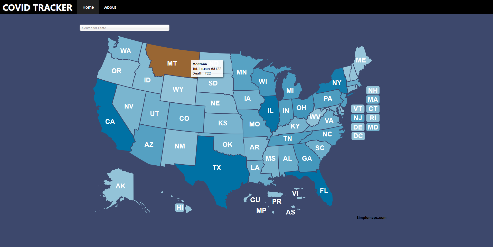
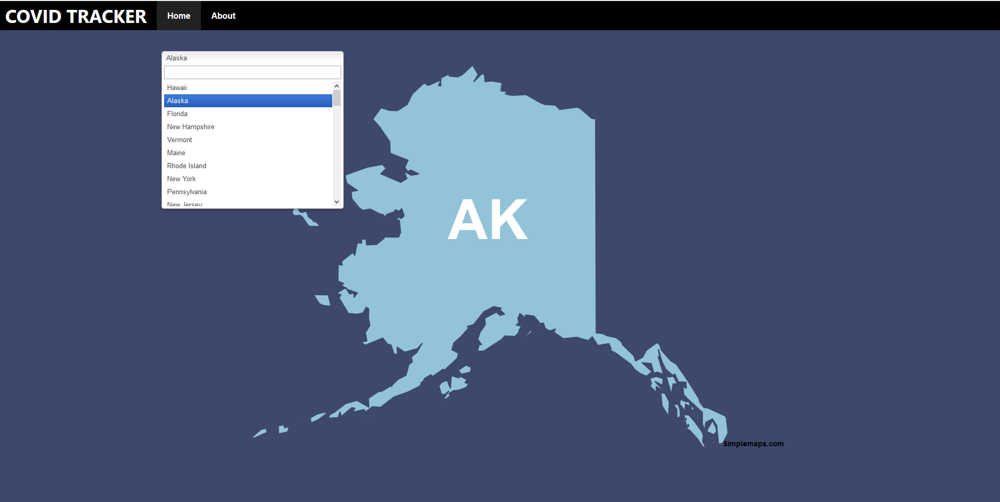

# Senior Design Group 5: Covid Tracker

We have created a website in which tracks covid information in the United States and posts it in an interactive map which reveals covid information about that particular state.

## Usage

To use the covid tracker, first access the website:
[Safeplains](https://safe-plains-70114.herokuapp.com)

Afterwards the webpage is displayed and you see the map, a search bar, and a navigation bar that leads back to the main page or the about page containing who created the website.

There are three main ways to get covid information
1. Hovering over a state  
    Will show the covid information of that state
    
2. Clicking on a state
    Will take you to a page that shows the covid information on a table
    
3. Clicking on the search bar then typing the state
    Will zoom in on that state and then either clicking or hovering will lead you to 1. or 2.
    